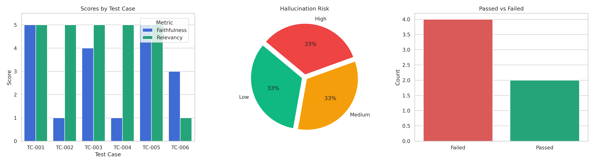

# Automated LLM Evaluation and Hallucination Benchmark

I built this project to automate the quality assurance process for Large Language Model (LLM) responses. When working with retrieval-augmented generation (RAG) or enterprise prompt pipelines, manually reviewing generated outputs against source documents is slow, subjective, and expensive. 

This pipeline uses an automated LLM-as-a-judge pattern to grade candidate answers against reference context and user prompts. It enforces structured JSON outputs using Pydantic schemas so the results can be analyzed programmatically without parsing errors.

---

## Evaluation Dashboard

The script automatically generates a three-part visual summary:
1. **Metric Scores by Test Case:** A comparison of Faithfulness and Relevancy scores (1 to 5 scale) across all benchmark runs.
2. **Hallucination Risk Distribution:** A breakdown of responses classified into Low, Medium, and High hallucination risk tiers.
3. **Quality Gate Decisions:** A summary count of responses that passed or failed the production quality threshold.

---

## How the Evaluation Logic Works

The evaluation engine checks candidate responses against reference context using four specific criteria:

* **Faithfulness (1 to 5):** Checks whether every claim in the answer is explicitly grounded in the source text. A score of 5 means zero unverified assertions; a score of 1 indicates total fabrication.
* **Answer Relevancy (1 to 5):** Evaluates if the response directly addresses the user question or drifts into irrelevant details.
* **Hallucination Flag:** A boolean check (`True`/`False`) that triggers if any statement cannot be deduced from the provided context, tagged with a severity level (`Low`, `Medium`, or `High`).
* **Qualitative Reasoning:** A text field where the judge model explicitly writes out the reason for deducting points, making it easy to identify failure root causes.

### Strict Schema Enforcement via Pydantic
A common issue with LLM-as-a-judge setups is inconsistent formatting (such as random markdown tags or missing keys). I used a Pydantic model (`LLMEvaluationResult`) to validate that every evaluation response contains the required types, bounds (e.g., scores strictly between 1 and 5), and fields before appending the result to the audit log.

### Production Pass/Fail Rule
To mirror a real deployment check, a response only passes the audit if:
* Faithfulness is 4 or higher
* Relevancy is 4 or higher
* Hallucination is `False`

Test cases that fail this check are flagged in the console and written to an error log for review.

---

## Repository Files

* **automated_llm_evaluation_framework.ipynb** - The primary Google Colab notebook containing the pipeline, test cases, and plotting code.
* **evaluation_dashboard.png** - The exported chart visualizing score distributions and audit pass rates.
* **llm_evaluation_audit_report.csv** - Complete audit log containing prompts, reference context, model outputs, scores, and failure reasoning.
* **README.md** - Project documentation and technical details.

---

## How to Run

1. Open `automated_llm_evaluation_framework.ipynb` in Google Colab or your local Jupyter environment.
2. Install the required packages: `pip install groq pydantic pandas matplotlib seaborn`.
3. Provide a free API key from `console.groq.com` when prompted.
4. Run all cells. The notebook will automatically detect your account's active model, evaluate the test dataset, display the metrics table, plot the dashboard, and export the CSV report.
